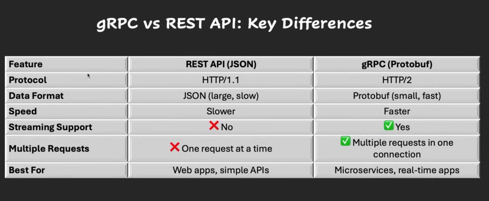
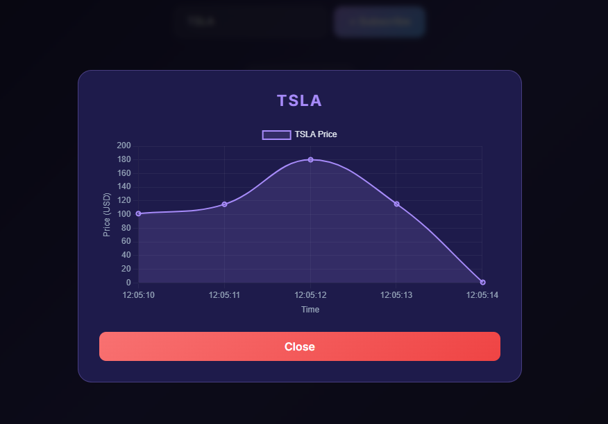
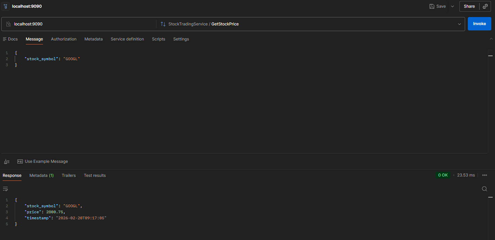

# Spring Boot gRPC Stock Trading System

A comprehensive real-time stock trading and price consultation system built with Spring Boot and gRPC. This project demonstrates various gRPC communication patterns, including Unary, Server-Streaming, Client-Streaming, and Bidirectional Streaming.



## 🚀 Features

- **Stock Price Consultation**: Retrieve current prices for specific stock symbols (Unary RPC).
- **Real-time Price Subscription**: Subscribe to a stream of live stock price updates (Server-Streaming).
- **Bulk Order Processing**: Submit multiple stock orders in a single stream and receive a summary (Client-Streaming).
- **Live Trading**: Real-time bidirectional trading with immediate status updates (Bidirectional Streaming).

## 🏗️ Architecture

The system consists of two main components:

1.  **[Stock Trading Server](stock-trading-server)**: The gRPC server that manages stock data and provides the trading services.
2.  **[Stock Trading Client](stock-trading-client)**: A Spring Boot web application (Thymeleaf) that interacts with the server via gRPC.

## 🛠️ Technologies Used

- **Java 21**
- **Spring Boot 3.4.1 / 4.0.3**
- **gRPC & Protobuf** (Protocol Buffers)
- **MySQL** (Server-side storage)
- **Thymeleaf** (Client-side UI)
- **Maven** (Build Tool)

---

## ⚙️ Getting Started

### 1. Prerequisites

- **JDK 21** or higher.
- **Apache Maven** installed.
- **MySQL Server** running.

### 2. Server Setup

1.  **Create Database**:
    ```sql
    CREATE DATABASE stock_trading_db;
    ```
2.  **Configure `application.properties`**: Update credentials in `stock-trading-server/src/main/resources/application.properties`.
3.  **Run Server**:
    ```bash
    cd stock-trading-server
    mvn clean install
    mvn spring-boot:run
    ```

### 3. Client Setup

1.  **Run Client**:
    ```bash
    cd stock-trading-client
    mvn clean install
    mvn spring-boot:run
    ```
2.  **Access UI**: Open `http://localhost:8080` in your browser.

---

## 📡 gRPC API Reference

| RPC Method            | Type             | Description                                       |
| :-------------------- | :--------------- | :------------------------------------------------ |
| `GetStockPrice`       | Unary            | Returns the current price for a stock symbol.     |
| `SubscribeStockPrice` | Server Streaming | Streams constant price updates for a symbol.      |
| `BulkStockOrder`      | Client Streaming | Aggregates multiple orders into a single summary. |
| `LiveTrading`         | Bidirectional    | Interactive order placement with status replies.  |

---

## 📊 Visualizations

### Real-time Stock Subscription


### Price Trend Visualization



### gRPC Unary Request (Postman/gRPC GUI)



## 🧪 Testing

Both projects include comprehensive tests:

- **Server**: `StockTradingImplTest` verifies service logic and RPC handling.
- **Client**: `StockClientServiceTest` and `StockStreamingControllerTest` verify gRPC stub interaction and UI controllers.

Run tests using:

```bash
mvn test
```

## 📜 License

This project is for educational purposes. Ricardo Vega 2026.
Licensed under the [MIT License]
